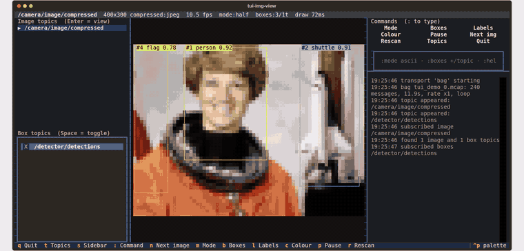

# Docker tutorial

The quickest way to run the viewer is in a container. Nothing to install on
the host but Docker; ROS 2 is inside the image when you need it.

## 1. Prerequisites

- Docker Engine 24+ with the Compose plugin (`docker compose version` prints a
  version). Docker Desktop on macOS or Windows works for the bag and demo
  services; the live ROS 2 service needs Linux (see step 4).
- A terminal with 24-bit colour and a Unicode font: any modern terminal
  emulator qualifies (GNOME Terminal, Konsole, iTerm2, Windows Terminal,
  Alacritty, kitty, WezTerm). Over SSH, `tmux` and `mosh` are fine too.

Clone the repository once; every command below runs from its root:

```bash
git clone https://github.com/guilyx/tui_img_view_ros2.git
cd tui_img_view_ros2
```

!!! tip "Shorter commands"
    `export COMPOSE_FILE=.docker/docker-compose.yml` once per shell and drop
    the `-f .docker/docker-compose.yml` from every command on this page.

## 2. See it work: the demo bag

```bash
docker compose -f .docker/docker-compose.yml run --rm demo
```

The first run builds the `slim` image (about a minute, ~200 MB). Then the
viewer opens on the bundled demo bag: real photographs on
`/camera/image/compressed` and hand-annotated boxes on `/detector/detections`.



Things to try while it runs:

| key | action |
|---|---|
| ++m++ | cycle render modes: half-block → quadrant → braille → ascii |
| ++f++ | cycle image filters (gray, invert, sepia, blur, edges, ...) |
| ++b++ / ++l++ | boxes / captions on and off |
| ++t++ / ++s++ | hide the topic panel / the command + log sidebar |
| ++colon++ | type a command, e.g. `filter edges`, `mode ascii`, `stale 5` |
| ++q++ | quit |

Any `tui-img-view` argument can follow the service name:

```bash
docker compose -f .docker/docker-compose.yml run --rm demo -m braille --filter edges --hide-topics
```

Full key and command reference: [Usage](usage.md).

## 3. View your own recording (no ROS needed)

Any rosbag2 recording in MCAP storage works, as a directory or a single
`.mcap` file. Point `BAG` at it; it is mounted read-only at `/bag`:

```bash
BAG=/data/drive_2026-09-01 docker compose -f .docker/docker-compose.yml run --rm bag
BAG=/data/drive_2026-09-01/drive_0.mcap docker compose -f .docker/docker-compose.yml run --rm bag -b /yolo/detections
RATE=0.5 BAG=/data/drive_2026-09-01 docker compose -f .docker/docker-compose.yml run --rm bag
```

Image and box topics are discovered from the bag's channels and listed in
the topic panel. Supported message types are listed in
[ROS 2 transport](ros2.md); anything else can be mapped with a
[custom box type](custom-box-types.md), for example:

```bash
BAG=/data/rec docker compose -f .docker/docker-compose.yml run --rm bag \
  --box-type "my_msgs/msg/Objects:items=objects,x=rect.x,y=rect.y,w=rect.w,h=rect.h,label=name"
```

!!! note "SQLite bags"
    Only MCAP storage is read directly. Convert an older SQLite bag once with
    `ros2 bag convert` (or play it with ROS and use step 4).

## 4. View a live ROS 2 graph

This uses the `ros2` image (`ros:jazzy-ros-base` plus the viewer, ~900 MB,
built on first use). It joins the host's network and IPC namespaces so DDS
discovery sees the nodes on your machine, which requires Linux.

```bash
docker compose -f .docker/docker-compose.yml run --rm viewer
```

Topics are discovered on their own; pick them in the panel or pre-select:

```bash
docker compose -f .docker/docker-compose.yml run --rm viewer -i /camera/image_raw -b /yolo/detections
```

Match the container to your ROS setup with environment variables:

| variable | default | when to change |
|---|---|---|
| `ROS_DOMAIN_ID` | `0` | your nodes run on another domain |
| `ROS_LOCALHOST_ONLY` | `0` | set to `1` if your nodes use it |
| `RMW_IMPLEMENTATION` | `rmw_fastrtps_cpp` | your nodes use Cyclone DDS (`rmw_cyclonedds_cpp`) or another RMW |
| `ROS_DISTRO` | `jazzy` | build for Humble or Iron: `ROS_DISTRO=humble docker compose ... build viewer` |

```bash
ROS_DOMAIN_ID=7 RMW_IMPLEMENTATION=rmw_cyclonedds_cpp docker compose -f .docker/docker-compose.yml run --rm viewer
```

Any command that is not a viewer flag runs as-is inside the sourced ROS
environment, which is handy for checking discovery:

```bash
docker compose -f .docker/docker-compose.yml run --rm viewer ros2 topic list
docker compose -f .docker/docker-compose.yml run --rm viewer ros2 topic hz /camera/image_raw
```

### No camera around? Play the demo bag into the graph

In one terminal:

```bash
docker compose -f .docker/docker-compose.yml --profile ros-demo run --rm bag-play
```

In another:

```bash
docker compose -f .docker/docker-compose.yml run --rm viewer -i /camera/image/compressed -b /detector/detections
```

This exercises the same path a real camera and detector would.

## 5. Everyday use

- Always `run --rm`, never `up -d`: it is an interactive TUI and needs a TTY.
- `docker compose ... build` after pulling new code; the images bake the
  package in.
- Plain `docker` instead of compose:

    ```bash
    docker build -f .docker/Dockerfile --target slim -t tui_img_view:slim .
    docker run --rm -it tui_img_view:slim                     # demo bag
    docker run --rm -it -v /data/rec:/bag:ro tui_img_view:slim -t bag -o path=/bag
    docker run --rm tui_img_view:slim -t fake --snapshot      # one frame to stdout, no TTY needed

    docker build -f .docker/Dockerfile --target ros2 -t tui_img_view:ros2 .
    docker run --rm -it --network host --ipc host tui_img_view:ros2
    ```

- `--snapshot` prints one frame as ANSI text and exits, so it works in
  scripts and without `-it`: pipe it to a file for a bug report.

## 6. Troubleshooting

**Blocks show as `?` or boxes.** The terminal font lacks the glyphs. Switch
to a font with block and box-drawing characters (most monospace fonts
have them) or use `-m ascii`.

**Colours look flat or banded.** The terminal is not in truecolour mode. The
image sets `COLORTERM=truecolor`; check your emulator supports 24-bit colour
and, over `tmux`, add `set -g default-terminal "tmux-256color"` and
`set -ga terminal-overrides ",*:Tc"` to `~/.tmux.conf`.

**`viewer` finds no topics.** Discovery is not reaching the container.
Check, in order: `ROS_DOMAIN_ID` matches; `RMW_IMPLEMENTATION` matches what
your nodes use; you are on Linux with `network_mode: host` (Docker Desktop
does not share the host network); `ros2 topic list` from inside the
container (see step 4) shows the same as on the host.

**`bag` says "no image or box topics found".** The recording uses message
types the viewer does not know. `ros2 bag info` lists them; add a
[custom box type](custom-box-types.md) for boxes, or open an issue for an
image encoding.

**Permission denied on the mounted bag.** The container runs as an
unprivileged user; make the bag directory world-readable
(`chmod -R a+rX /data/rec`) or run with `--user "$(id -u)"`.

**The image is stretched.** Your font's cell aspect is not 1:2. Pass
`--cell-aspect 0.45` (or whatever `width/height` your font's cells have), or
type `:aspect 0.45` while it runs until circles look round.
