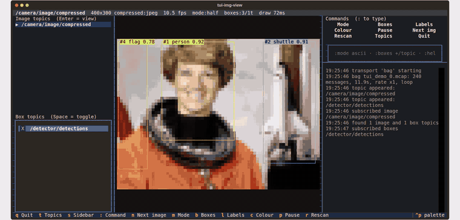

# tui_img_view

Watch an image stream **and its bounding boxes in the terminal**. No X, no GUI,
works over SSH. Built for ROS 2, but the viewer core does not know what ROS is:
a *transport* turns any message source into frames and boxes.



## In one minute

=== "With ROS 2"

    ```bash
    pip install -e .
    tui-img-view --image /camera/image_raw --boxes /yolo/detections
    ```

=== "With the demo bag, no ROS"

    ```bash
    pip install -e ".[bag]"
    tui-img-view -t bag -o path=demo/bags/tui_demo -b /detector/detections
    ```

=== "Synthetic scene"

    ```bash
    pip install -e .
    tui-img-view -t fake
    ```

## What you get

- **Four render modes**, cycled with ++m++: `half` (▀ blocks, 24-bit colour),
  `quadrant`, `braille` (dithered dots), `ascii`.
- **Boxes from any number of topics at once**, drawn as box glyphs with
  `label score` / `#track_id` captions in stable per-label colours.
- **Topic panel**: pick the image topic, toggle box topics.
- **Command panel and log**: buttons and a `:` command line, with a scrolling
  log of subscriptions, topic changes and decoder errors.
- **Status bar**: resolution, encoding, fps, latency, box count, decoder errors.
- **`--snapshot`**: one frame as ANSI text to stdout, for pipes and bug reports.
- **Custom message types** without code, see
  [Custom box message types](custom-box-types.md).
- **Pluggable transports**: `ros2`, `bag` (MCAP, no ROS), `fake`, and yours.

## Where next

- [Install](install.md), then [Usage](usage.md) for every key and flag.
- [Demo bag](demo.md) to see it on real photos.
- [Architecture](architecture.md) for how the pieces fit.
- [Contributing](contributing.md), [Changelog](changelog.md) and the
  [MIT License](license.md).
